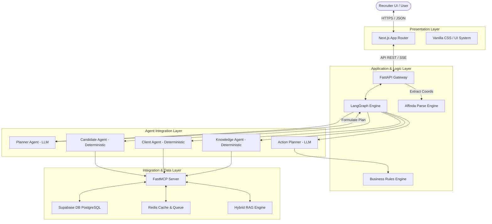
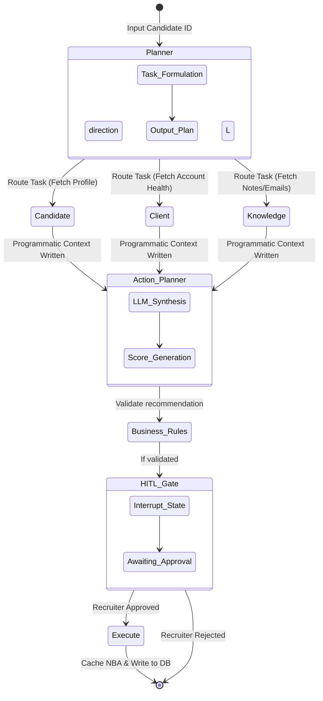
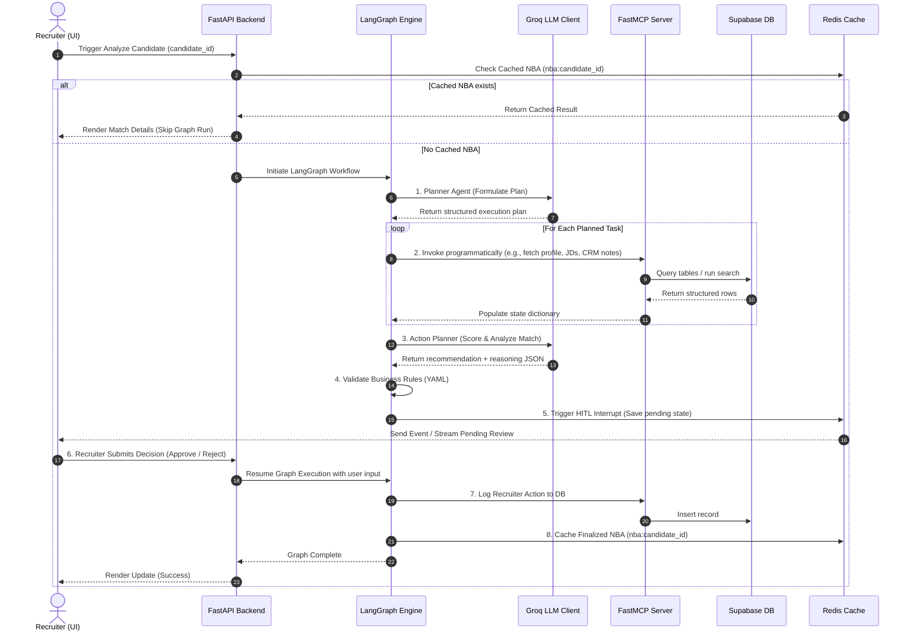
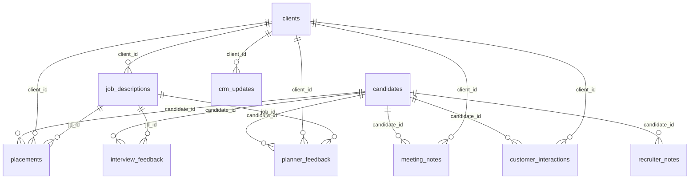

# System Architecture: ContextOS
## Enterprise AI Operating System for Recruiting

This document details the software architecture, system components, data flows, and design decisions of **ContextOS**, an enterprise-grade AI decision-support platform designed to optimize talent acquisition and candidate matching.

---

## 1. Problem Statement

Modern corporate talent acquisition is bottlenecked by fragmented tools, manual data gathering, and cognitive overload. Enterprise recruiting teams face significant operational inefficiencies:

* **Limitations of Keyword-Based ATS Systems**: Traditional Applicant Tracking Systems (ATS) rely on exact-string matching, missing high-quality candidates who express equivalent skills via synonyms (e.g., matching "Kubernetes" but missing "K8s" or "container orchestration").
* **Disconnected Enterprise Knowledge**: Historical candidate records, client account health scores, email correspondence, recruiter screening notes, and interview feedback are isolated across disparate databases, CRMs, and email archives, preventing unified evaluations.
* **Recruiter Decision Fatigue**: Recruiters must manually parse and compile data across multiple tools for each candidate, leading to suboptimal decisions, slow time-to-hire, and inconsistent evaluations.
* **Duplicated Submissions**: Candidates are frequently submitted to multiple roles or different departments of the same client without cross-referencing, causing client friction and internal team misalignment.
* **Policy and Business-Rule Violations**: Organizations struggle to enforce compliance rules (e.g., cool-off periods, salary bands, regional compliance, client hiring freezes) during candidate shortlisting.
* **Manual Context Gathering**: Reviewing past placement histories, performance outcomes, and communication history requires significant manual search, increasing operational overhead.

### The Need for a Decision-Support Platform
Rather than building an autonomous, non-deterministic system that makes hiring decisions without human oversight, recruiters require a structured **AI decision-support operating system**. This system must autonomously gather context, validate compliance, and recommend matches, while keeping the recruiter firmly in control as the final decision-maker.

---

## 2. Solution Overview

**ContextOS** is an AI-powered operating system for recruitment workflows. It orchestrates context gathering, business-rule validation, and recommendation generation. The platform does not automate hiring decisions; instead, it generates **Next Best Actions (NBAs)** for recruiters to review, approve, or reject.

Key pillars of the ContextOS architecture include:
* **Hybrid Orchestration**: Combines autonomous planning with deterministic, policy-driven execution.
* **LangGraph Orchestration**: Executes workflows as a stateful graph that supports parallel execution, loops, and state persistency.
* **Model Context Protocol (MCP)**: Decouples the AI models from underlying database schemas by using standardized, decoupled tool servers.
* **Explainability Logs**: Generates real-time trace outputs mapping how the AI retrieved data, applied business rules, and formulated confidence scores.
* **Business Governance**: Validates every recommendation against a structured, YAML-defined business rules engine.
* **Human-in-the-Loop (HITL) Gate**: Temporarily halts the graph execution state and pushes a pending approval card to the recruiter dashboard.

```
Recruiter Agency (Final Approver)
        ▲
        │ [Approve / Reject]
┌─────────────────────────────────┐
│           ContextOS             │
│  ┌───────────────────────────┐  │
│  │   LangGraph Orchestrator  │  │
│  └─────────────┬─────────────┘  │
│                ▼                │
│  ┌───────────────────────────┐  │
│  │   Deterministic Agents    │  │
│  └─────────────┬─────────────┘  │
│                ▼                │
│  ┌───────────────────────────┐  │
│  │     MCP Tool Server       │  │
│  └───────────────────────────┘  │
└─────────────────────────────────┘
```

---

## 3. High-Level System Architecture

The ContextOS system is organized in a layered architecture to ensure separation of concerns, scalability, and ease of deployment.



### Architectural Layers

1. **Presentation Layer (Next.js)**: A single-page application built on Next.js. It features a recruiter dashboard, a candidate intelligence pipeline, interactive visualization of parsed resumes with coordinate highlights, and a human-in-the-loop validation queue.
2. **Application Gateway (FastAPI)**: Serves as the primary entry point for frontend calls. It manages API routing, handles file uploads, routes parsing requests to Affinda, and initiates LangGraph executions.
3. **Orchestration Layer (LangGraph)**: Manages stateful agent transitions. It uses a graph-based state to direct variables, tracks completed tasks, and saves state checkpoints to support interrupts.
4. **Agent Integration Layer**: Hosts specialized nodes. LLMs are restricted to the **Planner** and **Action Planner** nodes to reduce token consumption and latency, while candidate, client, and knowledge retrieval are performed programmatically (deterministic).
5. **Integration & Data Layer (MCP)**: Establishes a standard interface between agents and databases. A python-based `FastMCP` server wraps access to Supabase, Redis, and internal filesystems.

---

## 4. Component Architecture

Each subsystem within ContextOS has a distinct set of responsibilities, strict inputs/outputs, and defined communications interfaces.

| Component | Primary Responsibility | Inputs | Outputs | Dependencies | Communication Protocol |
| :--- | :--- | :--- | :--- | :--- | :--- |
| **Frontend** | Renders recruiter UI, displays NBA queue, highlights parsed resume coordinates, and handles interactive candidate editing/submission. | REST payloads, Server-Sent Events | File Upload streams, JSON payloads | Next.js, Framer Motion, Tailwind CSS | HTTPS, SSE |
| **FastAPI Backend** | Handles HTTP requests, triggers LangGraph workflows, and queries Redis cache for real-time log streaming. | HTTP Requests, Multipart files | JSON payloads, API responses | Python FastAPI, Uvicorn | WSGI / HTTP |
| **LangGraph Engine** | Manages execution state, evaluates task routing conditions, and triggers human-in-the-loop interrupts. | Initial Candidate ID, Client ID | Candidate recommendation score, reasoning trace | LangGraph, LangChain | Internal Python calls |
| **FastMCP Server** | Decouples backend schemas; exposes database actions, placement histories, and CRM data as standard tools. | JSON RPC tool calls | Structured JSON response | Supabase client, Redis client | JSON-RPC over Standard I/O |
| **Business Rules Engine** | Evaluates candidate eligibility and flags policy compliance (e.g., cool-off periods, salary matches). | Recommended Job ID, Candidate profile | Boolean compliance flag, violation list | PyYAML | Internal Python function calls |
| **Planner Memory** | Maintains recruiter feedback histories; enables the Planner to adapt recommendations based on past actions. | Recruiter Approval/Rejection decisions, target ID | History vector, adjustment score | Postgres tables, Redis cache | SQL query, Redis client |

---

## 5. Multi-Agent Architecture

To balance autonomous reasoning with deterministic compliance, ContextOS separates the workflow into a LangGraph state machine. Specialist nodes execute programmatically, while the Planner and Action Planner utilize LLMs.



### Agent Detailed Specifications

#### 1. Planner Agent (LLM-Based)
* **Purpose**: Formulate the execution plan using candidate history, identifying what contextual information must be retrieved.
* **Inputs**: `candidate_id`, `candidate_data`, `planner_history`.
* **Reasoning Process**: The Planner reviews the available specialist agents and constructs a targeted set of tasks (e.g., "retrieve candidate profile", "check client relationship updates", "gather historical interview feedback"). It determines if tasks can run in parallel or sequentially.
* **Outputs**: `planner_tasks` (a structured array of agent tasks), `execution_mode` (`parallel` or `sequential`).

#### 2. Candidate Agent (Deterministic)
* **Purpose**: Fetch the candidate profile, resume text, and past placement history.
* **Inputs**: `candidate_id`.
* **Reasoning Process**: Bypasses LLM. It queries the MCP tool `get_candidate_profile` followed by `get_placement_history`. It checks for duplicate placements or active submissions.
* **Outputs**: `candidate_data` (JSON), `skills` (list), `placement_history` (list).

#### 3. Client Agent (Deterministic)
* **Purpose**: Retrieve matching job openings, company health, and priority metrics.
* **Inputs**: Candidate skills list.
* **Reasoning Process**: Calls the `search_job_descriptions` tool to match jobs based on skill tags. For each candidate match, it queries the `get_client_account_health` tool to identify priority, accounts with hiring freezes, or clients with poor health scores.
* **Outputs**: `matched_jobs` (list), `client_metadata` (dict).

#### 4. Knowledge Agent (Deterministic)
* **Purpose**: Retrieve historical interaction logs, email context, recruiter notes, and interview feedback.
* **Inputs**: `candidate_id`, `matched_jobs` client IDs.
* **Reasoning Process**: Calls `get_candidate_knowledge` via MCP, which compiles data from emails, crm logs, playbooks, and recruiter notes.
* **Outputs**: `knowledge_context` (compiled dictionary containing interaction logs).

#### 5. Action Planner Agent (LLM-Based)
* **Purpose**: Synthesize all gathered context, evaluate matches, and generate a confidence score.
* **Inputs**: Combined state (`candidate_data`, `matched_jobs`, `client_metadata`, `knowledge_context`).
* **Reasoning Process**: Executes an LLM call to synthesize the candidate profile against job descriptions. It weighs CRM updates, interview feedback, and account health to score the placement suitability from `0.0` to `1.0`.
* **Outputs**: `top_recommendation` (Job ID, title, client name, confidence), `reasoning` (detailed analysis text).

#### 6. Business Rules Node (Deterministic)
* **Purpose**: Ensure strict adherence to corporate compliance and recruiter rules.
* **Inputs**: Candidate profile and `top_recommendation`.
* **Reasoning Process**: Evaluates data against YAML rules. Flags candidates who fail to meet the minimum experience requirements, fall outside the salary range, or apply to a client with an active hiring freeze.
* **Outputs**: `business_rule_trace` (violation list, pass/fail status).

#### 7. Human-in-the-Loop (HITL) Gate
* **Purpose**: Halt the execution thread to wait for recruiter review.
* **Inputs**: LangGraph state containing recommendations and reasoning.
* **Reasoning Process**: Triggers a LangGraph `interrupt`. Pushes the session details to the Redis pending queue and notifies the frontend. Once the recruiter clicks "Approve" or "Reject", the state resumes.
* **Outputs**: `recruiter_decision` (string: `"approved"` or `"rejected"`).

#### 8. Execute Node (Deterministic)
* **Purpose**: Finalize the decision, update records, and cache results.
* **Inputs**: `recruiter_decision`, `top_recommendation`.
* **Reasoning Process**: Persists the recruiter action to Supabase via `log_recruiter_action` and updates the Redis-cached Next Best Action queue.
* **Outputs**: Finalized session state write.

---

## 6. Model Context Protocol (MCP) Layer

The **Model Context Protocol (MCP)** is a foundational component of ContextOS. It separates the agentic reasoning layer from the database infrastructure.

```
┌────────────────────────────────────────────────────────┐
│                      ContextOS App                     │
│                                                        │
│   ┌────────────────────┐      ┌────────────────────┐   │
│   │   Planner Agent    │      │   Action Planner   │   │
│   └─────────┬──────────┘      └─────────┬──────────┘   │
└─────────────┼───────────────────────────┼──────────────┘
              │ JSON-RPC calls            │
              ▼                           ▼
┌────────────────────────────────────────────────────────┐
│                    FastMCP Server                      │
│                                                        │
│  [get_candidate_profile]    [search_job_descriptions]  │
│  [get_placement_history]    [get_candidate_knowledge]  │
└─────────────┬───────────────────────────┬──────────────┘
              │ Direct SQL                │ Direct Cache
              ▼                           ▼
       ┌──────────────┐            ┌──────────────┐
       │ Supabase DB  │            │ Redis Cache  │
       └──────────────┘            └──────────────┘
```

### Why MCP Was Chosen
1. **Decoupled Architecture**: Specialist agents call standardized functions like `get_candidate_profile` without needing direct database connections or SQL knowledge.
2. **Database Neutrality**: The database engine can be swapped (e.g., from PostgreSQL to MongoDB or SQLite) by updating the MCP server implementation; agent prompts and graph code remain unchanged.
3. **Secure Boundaries**: The database is accessible only through defined, audited tool endpoints, enforcing strict boundaries on what the agent can retrieve or modify.

### Core MCP Tools Implemented

* `get_candidate_profile(candidate_id)`: Retrieves a candidate's structured profile. Checks Redis cache first, falling back to Supabase.
* `get_client_account_health(client_id)`: Fetches account details, client priority, and hiring freeze statuses.
* `search_job_descriptions(query_skills)`: Analyzes client JDs, matches required skills, and computes an initial match score.
* `get_placement_history(candidate_id, client_id)`: Fetches candidate placement histories.
* `search_meeting_notes(client_id, candidate_id)`: Returns unstructured CRM and internal meeting transcripts.
* `search_emails(sender, recipient)`: Scans communication histories between the recruiter, candidate, and clients.
* `get_candidate_knowledge(candidate_id)`: Aggregates meeting notes, email threads, CRM entries, and playbooks.

---

## 7. Data Flow

The sequence diagram below displays the end-to-end lifecycle of a candidate evaluation request:




## 8. Database Schema

ContextOS leverages a relational schema in Supabase (PostgreSQL) optimized for candidate intelligence, client metrics tracking, history logging, and knowledge item retrieval.

### Entity-Relationship Diagram



### Table Definitions & Metadata

#### 1. candidates
Stores structured candidate profiles parsed from resumes.
* `id` (uuid, Primary Key): Unique candidate identifier.
* `name` (text, Not Null): Full name.
* `email` (text, Nullable): Email address.
* `skills` (text[], Nullable): Array of skills keywords.
* `experience_years` (integer, Nullable): Total years of professional experience.
* `current_position` (text, Nullable): Candidate's active job role.
* `location` (text, Nullable): Geographic location.
* `status` (text, Default `'available'`): Recruitment availability state.
* `resume_text` (text, Nullable): Full text/summary content parsed from the resume.
* `created_at` (timestamptz): Timestamp when added.

#### 2. clients
Tracks hiring client companies and relationship status.
* `id` (uuid, Primary Key): Unique client identifier.
* `name` (text, Not Null): Client company name.
* `industry` (text, Nullable): Industry sector (e.g. Technology).
* `account_health` (integer, Default `100`): Account relationship status score.
* `last_contact_date` (date, Nullable): Date of latest communication.
* `open_roles_count` (integer, Default `0`): Active roles count.
* `created_at` (timestamptz): Creation timestamp.

#### 3. job_descriptions
Maintains job openings and requirements details.
* `id` (uuid, Primary Key): Unique JD identifier.
* `client_id` (uuid, Foreign Key -> `clients.id`): Associated client.
* `title` (text, Not Null): Job title.
* `required_skills` (text[], Nullable): Array of required candidate skills.
* `location` (text, Nullable): Role location.
* `salary_range` (text, Nullable): Compensation bracket.
* `status` (text, Default `'open'`): Opening state (e.g. `'open'`, `'filled'`).
* `description_text` (text, Nullable): Detailed job role text.
* `created_at` (timestamptz): Creation timestamp.

#### 4. placements
Records past matching outcomes for analytical evaluation.
* `id` (uuid, Primary Key): Unique placement log ID.
* `candidate_id` (uuid, Foreign Key -> `candidates.id`): Placed candidate.
* `client_id` (uuid, Foreign Key -> `clients.id`): Associated client.
* `jd_id` (uuid, Foreign Key -> `job_descriptions.id`): Associated JD.
* `placement_date` (date, Nullable): Date of successful hire.
* `success` (boolean, Default `true`): Status indicator.
* `notes` (text, Nullable): Review notes.
* `created_at` (timestamptz): Creation timestamp.

#### 5. recruiter_actions
Stores recruiter decisions and log tracks.
* `id` (uuid, Primary Key): Unique action log ID.
* `action_type` (text, Not Null): e.g. `'pitch_candidate'`.
* `target_id` (uuid, Nullable): Identifier of target entity.
* `target_type` (text, Nullable): e.g. `'candidate'`.
* `reason` (text, Nullable): Recruiter's explanation reasoning.
* `recruiter_decision` (text, Nullable): Decision status (`'approved'`, `'rejected'`).
* `outcome` (text, Nullable): Execution result log.
* `created_at` (timestamptz): Creation timestamp.

#### 6. knowledge_items
Provides unified storage for embedding-based semantic retrieval.
* `id` (uuid, Primary Key): Unique knowledge asset ID.
* `type` (varchar, Not Null): Category of knowledge asset.
* `source` (varchar, Not Null): Document/origin indicator.
* `entity_type` (varchar, Nullable): e.g., `'candidate'`, `'client'`.
* `entity_id` (varchar, Nullable): Connected entity key.
* `title` (varchar, Nullable): Brief header.
* `summary` (text, Nullable): Summary description.
* `content` (text, Nullable): Complete textual body.
* `metadata` (jsonb, Nullable): Key-value properties.
* `embedding` (vector, Nullable): Semantic embedding vectors.
* `embedding_model` (varchar, Nullable): Version/spec of embedding LLM.
* `embedding_version` (varchar, Nullable): Model release version tag.
* `embedded_at` (timestamptz, Nullable): Embedding calculation date.
* `updated_at` (timestamptz): Update timestamp.

#### 7. recruiter_notes
Contains informal recruiter candidate screening notes.
* `id` (uuid, Primary Key): ID key.
* `candidate_id` (varchar, Not Null): Associated candidate reference.
* `notes` (text, Nullable): Informal observation log.
* `created_at` (timestamptz): Creation timestamp.

#### 8. meeting_notes
Tracks call/meeting transcripts between clients, candidates, and recruiters.
* `id` (uuid, Primary Key): ID key.
* `client_id` (varchar, Not Null): Client reference.
* `candidate_id` (varchar, Nullable): Optional candidate reference.
* `meeting_date` (date, Not Null): Meeting date.
* `notes` (text, Nullable): Call/meeting transcript.
* `created_at` (timestamptz): Creation timestamp.

#### 9. emails
Email communication histories.
* `id` (uuid, Primary Key): Unique email key.
* `sender` (varchar, Not Null): Sender address.
* `recipient` (varchar, Not Null): Recipient address.
* `subject` (varchar, Nullable): Email subject.
* `body` (text, Nullable): Email body text.
* `sent_at` (timestamptz): Sent timestamp.

#### 10. crm_updates
Client-relationship updates log.
* `id` (uuid, Primary Key): Unique log key.
* `client_id` (varchar, Not Null): Associated client reference.
* `update_text` (text, Nullable): Log details.
* `created_at` (timestamptz): Creation timestamp.

#### 11. interview_feedback
Feedback scores from client interview panels.
* `id` (uuid, Primary Key): Unique key.
* `candidate_id` (varchar, Not Null): Candidate reference.
* `jd_id` (varchar, Not Null): JD reference.
* `feedback` (text, Nullable): Evaluation commentary.
* `rating` (integer, Nullable): Numeric score (e.g. 1-5).
* `created_at` (timestamptz): Creation timestamp.

#### 12. customer_interactions
Interactive log detailing general customer touchpoints.
* `id` (uuid, Primary Key): Key.
* `client_id` (varchar, Not Null): Client reference.
* `candidate_id` (varchar, Nullable): Candidate reference.
* `interaction_date` (date, Not Null): Date of contact.
* `type` (varchar, Nullable): e.g. `'call'`, `'email'`.
* `notes` (text, Nullable): Discussion logs.
* `created_at` (timestamptz): Creation timestamp.

#### 13. planner_feedback
Maintains closed-loop feedback metrics to optimize planner reasoning.
* `id` (uuid, Primary Key): Unique feedback key.
* `recommendation_id` (varchar, Nullable): Action session ID.
* `candidate_id` (varchar, Not Null): Candidate reference.
* `client_id` (varchar, Not Null): Client reference.
* `job_id` (varchar, Not Null): Match job description ID.
* `recruiter_decision` (varchar, Not Null): Recruiter decision status (e.g. `'approved'`).
* `decision_reason` (text, Nullable): Reasoning given by recruiter.
* `outcome` (varchar, Default `'pending'`): Placement stage outcome metric.
* `placement_success` (boolean, Default `false`): Hiring success flag.
* `placement_failure` (boolean, Default `false`): Hiring failure flag.
* `feedback_notes` (text, Nullable): Recruiter notes about the planner suggestions.
* `historical_confidence` (double precision, Nullable): Planner model initial score.
* `created_at` (timestamptz): Creation timestamp.
* `updated_at` (timestamptz): Last updated timestamp.

---

## 9. Technology Stack

| Layer | Technology | Selection Rationale |
| :--- | :--- | :--- |
| **Frontend** | **Next.js 16 (React 19)** | App Router provides structured page layouts, fast page rendering, and seamless API route integrations. |
| **CSS & Design** | **Vanilla CSS & Tailwind** | Custom CSS variables provide layout control, responsive dashboard grids, and clean visual highlights. |
| **Backend Gateway** | **FastAPI** | Lightweight, high-performance web framework. Fully supports async execution, file uploads, and auto-generated OpenAPI documentation. |
| **Agent Orchestration**| **LangGraph (LangChain)** | Enables stateful, multi-agent orchestrations with loops, parallel routing, and built-in human-in-the-loop state interrupts. |
| **Large Language Model**| **Groq Llama-3.3-70b-Versatile** | Provides high-speed inference, lowering average graph execution times to under 3 seconds while maintaining accurate JSON outputs. |
| **Primary Database** | **Supabase (PostgreSQL)** | Cloud PostgreSQL database. Provides instant REST APIs, relational schema support, and built-in vector features for scalable RAG pipelines. |
| **Cache & Queue** | **Redis (Local / Upstash)** | Serves as an in-memory key-value cache, stores agent logs, and acts as the queue for pending human-in-the-loop decisions. |
| **Integration Layer** | **Model Context Protocol (FastMCP)**| Decouples the AI models from underlying database schemas by using standardized, decoupled tool servers. |
| **Resume Parser** | **Affinda API Client** | Industry-standard resume extraction engine. Returns structured data fields along with layout bounding-box coordinates. |

---

## 10. Design Decisions & Trade-offs

During development, several architectural trade-offs were evaluated:

### 1. LangGraph vs. Chain of Thought Pipelines
* **Decision**: LangGraph was selected over standard linear LangChain pipelines.
* **Trade-off**: While a linear pipeline is easier to write and debug, it does not support cyclic execution (loops), parallel agent execution, or state restoration. LangGraph allows the Planner to dynamically branch and route tasks based on candidate data, and its state persistence supports human-in-the-loop interrupts.

### 2. Hybrid Agent Execution vs. Pure ReAct Loops
* **Decision**: LLM calls are limited to the **Planner** and **Action Planner** nodes; other specialist agents (Candidate, Client, Knowledge) run programmatically.
* **Trade-off**: Pure ReAct agents can dynamically decide what tools to invoke, but this pattern is non-deterministic and can require up to 20 LLM calls per run. This causes long response times (~120s) and high token costs. The hybrid model reduces average latency to under 3 seconds, makes data retrieval deterministic, and lowers API costs.

### 3. Shared State Model vs. Message Passing
* **Decision**: A central `AgentState` object was implemented.
* **Trade-off**: A shared state model allows nodes to view all gathered context, simplifying code. However, it can lead to state contamination if nodes overwrite keys. To prevent this, strict write-only keys were assigned to each agent.

### 4. Human-in-the-Loop Interrupts vs. Post-Processing Approval
* **Decision**: Implemented native graph interrupts (`interrupt` gates in LangGraph).
* **Trade-off**: Post-processing approval allows the graph to run to completion, saving the result as "pending". However, this does not allow recruiters to modify variables mid-flight. Native interrupts pause the graph state, allowing recruiters to edit parsed information before final evaluation.

### 5. Redis for Logging vs. Database Logs
* **Decision**: Real-time agent execution traces are streamed via Redis and served through SSE.
* **Trade-off**: Storing logs in Supabase provides persistence, but database writes add latency. Caching execution traces in Redis ensures real-time logging for the recruiter console with minimal system overhead.

---

## 11. Resume Parsing & Bounding Box Engine

ContextOS implements a resume parsing pipeline designed to increase data accuracy and build trust with recruiters through interactive UI overlays.

### 1. Normalization of Coordinate Spaces
The Affinda API returns bounding box coordinates (`x0`, `y0`, `x1`, `y1`) mapping where it extracted key information (e.g., Name, Email, Experience). These coordinates may be relative to page pixel bounds (e.g., `800x1100`).
The backend parser normalizes these coordinates:
$$\text{Normalized } X = \frac{X}{\text{Page Width}} \qquad \text{Normalized } Y = \frac{Y}{\text{Page Height}}$$
This normalizes coordinates to a range of `[0, 1]`, allowing the frontend to overlay highlight boxes on the resume page container.

### 2. Interactive Document Representation
To avoid loading heavy PDF-to-image canvas libraries in Next.js, the frontend renders a styled HTML document card. The card displays the candidate's actual parsed details (header, contact details, summary, skills tags, work history list) to look like a resume.
* **Category Highlight Overlays**: Absolute-positioned divs overlay on top of the document layout, aligned with the normalized coordinates.
* **Visual Color Mapping**: Bounding boxes are color-coded to match data fields: Full Name (Teal), Email (Blue), Location (Orange), Experience (Indigo), Skills (Rose), and Work History (Purple).
* **De-duplication**: To prevent overlapping boxes, the frontend and backend limit coordinate outputs to the first few matches (e.g., max 4 skills, max 2 work experiences).

---

## 12. Scalability & Future Enhancements

These features represent the planned roadmap for ContextOS:

### 1. Vector Database Integration for Semantics
* **Goal**: Move from skill-keyword matching to vector similarity searches.
* **Implementation**: Generate embeddings for candidate resumes and job descriptions using pgvector in Supabase, enabling search by concept (e.g., matching "data wrangler" with "ETL developer").

### 2. Specialist Agents Expansion
* **Goal**: Add specialized nodes to evaluate compensation structures and assess soft skills.
* **Implementation**: Integrate a Compensation Agent to evaluate equity and performance bonuses, and a Soft-Skills Agent to analyze interview sentiment.

### 3. Multi-Model Routing
* **Goal**: Optimize cost and performance by routing tasks to different LLMs.
* **Implementation**: Use smaller, faster models (e.g., Llama-3-8b) for the Planner, and larger models (e.g., Llama-3-70b or Claude 3.5 Sonnet) for the final Action Planner evaluation.

### 4. Enterprise Integrations
* **Goal**: Connect directly with external platforms.
* **Implementation**: Build MCP connectors to query Microsoft Outlook, Slack channels, and Workday HR systems directly.

### 5. Advanced Analytics Dashboard
* **Goal**: Measure matching accuracy and recruiter efficiency.
* **Implementation**: Build dashboards to track average time-to-hire, match acceptance rates, and model confidence scores over time.
