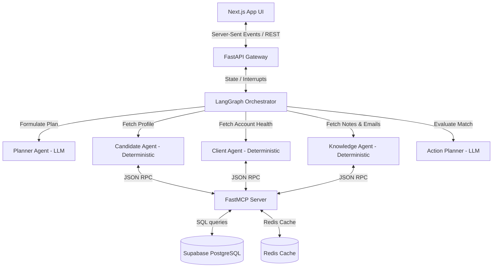
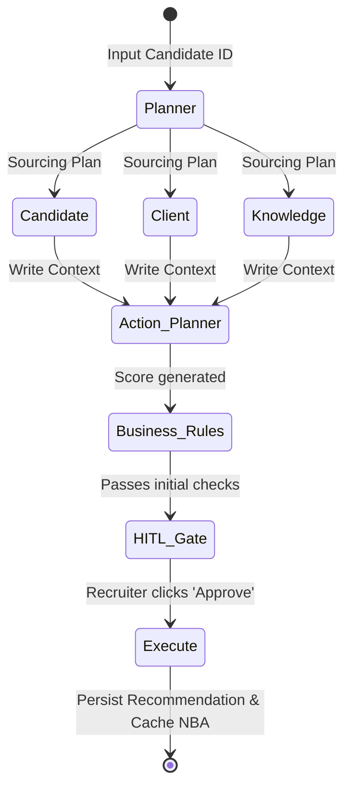

# ContextOS — Enterprise AI Operating System for Recruiting

[](https://fastapi.tiangolo.com)
[](https://nextjs.org)
[](https://github.com/langchain-ai/langgraph)
[](https://groq.com)
[](https://supabase.com)
[](https://redis.io)

ContextOS is an enterprise-grade AI decision-support platform designed to streamline corporate recruitment and talent matching. Using a stateful, multi-agent architecture powered by LangGraph, ContextOS aggregates data across isolated channels—resumes, client account health scores, CRM logs, and communication archives—to identify qualified candidates, validate policy compliance, and deliver real-time, explainable recommendations.

---

## 1. Project Overview

### What is ContextOS?
ContextOS acts as a central decision engine that transforms candidate sourcing and screening from a manual search process into an organized, agentic workflow. Rather than delegating recruitment decisions entirely to AI, ContextOS serves as a decision-support system. It compiles context, evaluates eligibility against business rules, and structures **Next Best Actions (NBAs)** for human recruiter approval.

```
┌────────────────────────────────────────────────────────────────────────┐
│                              ContextOS                                 │
│                                                                        │
│   ┌────────────────────┐    Programmatic Context    ┌──────────────┐   │
│   │  LangGraph Engine  ├───────────────────────────>│ Action Agent │   │
│   └─────────▲──────────┘                            └──────┬───────┘   │
│             │                                              │           │
│             │ Triggers Interrupt                           ▼           │
│   ┌─────────┴──────────┐   Approved Placement Status┌──────────────┐   │
│   │ Recruiter approval <────────────────────────────┤  HITL Gate   │   │
│   └────────────────────┘                            └──────────────┘   │
└────────────────────────────────────────────────────────────────────────┘
```

### Why ContextOS Exists
Enterprise corporate recruitment is hindered by disconnected systems and manual data gathering. 
1. **Keyword Sourcing Limits**: Legacy applicant tracking systems (ATS) miss qualified candidates due to simple keyword variations (e.g. failing to match "k8s" with "Kubernetes").
2. **Context Fragmentation**: Critical client details, recruitment notes, account health scores, and email exchanges remain trapped in separate databases, hindering decision-making.
3. **Policy Violations**: Ensuring candidates adhere to strict compliance parameters (such as cool-off periods, salary bands, and regional constraints) requires time-consuming manual validation.
4. **Decision Fatigue**: Recruiters spent hours parsing portfolios and chasing notes, leading to delays and inconsistent evaluations.

### Architectural Core
* **Human-in-the-Loop (HITL) Safety**: Graph executions pause at critical decision boundaries (gates), requiring explicit recruiter approval before updates are committed.
* **Autonomous Planning**: An LLM-based Planner dynamically reads candidate history to design a custom retrieval and scoring run.
* **Model Context Protocol (MCP)**: System agents do not interact with databases directly. Standardized FastMCP tool endpoints query PostgreSQL and Redis cache instances securely.
* **Deterministic Specialists**: Data collection nodes run programmatically (without LLMs) to minimize latency, eliminate hallucination, and reduce API token costs.

---

## 2. Key Features

```carousel
### Autonomous Planner
Formulates tailored evaluation plans, coordinating parallel data fetches to minimize execution latency.
<!-- slide -->
### Candidate Intelligence
Aggregates parsed resume entities, contact info, historical placements, and screening feedback.
<!-- slide -->
### Client Intelligence
Retrieves priority matching jobs and filters clients based on active hiring freezes.
<!-- slide -->
### Explainability Engine
Generates clear traces detailing how the system retrieved details, applied rules, and calculated confidence scores.
<!-- slide -->
### Business Rules Engine
Ensures strict compliance with experience minimums, salary limits, and cool-off periods.
```

* **Autonomous Planner (LLM-based)**: Evaluates incoming requests and customizes execution plans.
* **Candidate Intelligence**: Aggregates resume parser extractions, contact details, work history, and past submission records.
* **Client Intelligence**: Tracks priority accounts and filters out matching job roles affected by hiring freezes.
* **Knowledge Retrieval**: Compiles notes, emails, and interview feedback into a unified text block.
* **Explainability Engine**: Translates complex model runs into readable visual traces detailing rule checks and confidence scoring.
* **Human Approval Workflow (HITL)**: Pushes pending evaluations to a dashboard queue, saving states to allow variables editing before final submission.
* **Business Rules Engine (YAML-driven)**: Validates matches against corporate compliance policies.
* **Enterprise RAG**: Performs hybrid semantic and keyword searches on unstructured databases.

---

## 3. Platform Screenshots

### 1. Recruiter Command Center
The centralized control panel streams real-time agent execution logs, active pipelines, and pending action queues.


### 2. Candidate Sourcing & Pipeline
Recruiters review matched talent pipelines, search using skill filters, and trigger agent evaluations.


### 3. Interactive Resume Parser & Coordinate Overlay
ContextOS overlays color-coded bounding boxes directly on top of parsed document layouts, pinpointing the location of extracted fields.


### 4. Human-In-The-Loop (HITL) Decision Queue
Displays detailed matching justifications, confidence scores, and business rule traces awaiting recruiter approval.


### 5. Client Account Dashboard
Provides real-time visibility into hiring client accounts, priorities, health metrics, and open job roles.


### 6. Interactive Multi-Agent Run Console
Recruiters monitor agent tasks, trace execution runs, and edit variables on the fly.


### 7. Global Execution Logs & Audit Trail
Real-time Server-Sent Events (SSE) stream agent reasoning, database writes, and compliance evaluations.


### 8. System Database Relationships (ER Visual)
Visual representation of primary schemas and relational foreign keys.


### 9. Interactive Match Details Trace
Explains candidate score components, history matches, and CRM updates.


### 10. Planner Task Formulator View
Visualizes tasks formulated by the Planner Agent.


### 11. Recruiter Recommendation Action Panel
Interface displaying Next Best Actions (NBAs) and pitcher modules.


### 12. Candidate Intelligence Highlight Inspector
Inspects extracted skills, experience years, and locations.


---

## 4. System Architecture

ContextOS is built on a decoupled, layered system design:



### Architectural Layers
1. **Presentation Layer (Next.js)**: Displays a responsive recruiter dashboard, streams real-time Server-Sent Events (SSE) logs, and handles interactive candidate editing.
2. **Application Gateway (FastAPI)**: Manages REST API endpoints, handles resume file uploads, routes parsing requests to Affinda, and initiates LangGraph workflows.
3. **Orchestration Layer (LangGraph)**: Directs stateful transitions. Manages variables in a centralized state, routes node transitions, and saves checkpoints to Redis to support interrupts.
4. **Agent Integration Layer**: Coordinates specialist nodes. LLM processing is isolated to the **Planner** and **Action Planner** nodes to optimize latency, while candidate, client, and knowledge retrieval are performed programmatically (deterministic).
5. **Integration & Data Layer (MCP)**: Establishes a standard interface between agents and databases. A python-based `FastMCP` server wraps access to Supabase, Redis, and internal filesystems.

---

## 5. Multi-Agent Architecture

ContextOS splits workflow execution into specialized LangGraph nodes. Specialist nodes run programmatically (deterministic), while the Planner and Action Planner utilize LLMs.



### Specialist Agent Configurations

#### 1. Planner Agent (LLM-Based)
* **Purpose**: Formulate the execution plan using candidate history, identifying what contextual information must be retrieved.
* **Inputs**: `candidate_id`, `candidate_data`, `planner_history`.
* **Reasoning Loop**: Uses the LLM to inspect historical match parameters and select which specialist nodes (Candidate, Client, Knowledge) must run, and whether they can execute in parallel.
* **Outputs**: `planner_tasks` (array of tasks), `execution_mode` (parallel / sequential).

#### 2. Candidate Agent (Deterministic)
* **Purpose**: Retrieve candidate profile data and placement history.
* **Inputs**: `candidate_id`.
* **Reasoning Process**: Queries the `get_candidate_profile` and `get_placement_history` MCP tools. It checks for duplication or active submissions.
* **Outputs**: `candidate_data` (JSON), `skills` (list), `placement_history` (list).

#### 3. Client Agent (Deterministic)
* **Purpose**: Retrieve matching job openings, company health, and priority metrics.
* **Inputs**: Candidate skills list.
* **Reasoning Process**: Calls the `search_job_descriptions` tool to match open job listings. It queries `get_client_account_health` to check for active hiring freezes.
* **Outputs**: `matched_jobs` (list), `client_metadata` (dict).

#### 4. Knowledge Agent (Deterministic)
* **Purpose**: Gather historical interaction logs, email context, recruiter notes, and interview feedback.
* **Inputs**: `candidate_id`, client IDs of matched jobs.
* **Reasoning Process**: Invokes `get_candidate_knowledge` via MCP, which compiles data from emails, crm logs, playbooks, and recruiter notes.
* **Outputs**: `knowledge_context` (compiled interaction logs).

#### 5. Action Planner (LLM-Based)
* **Purpose**: Synthesize all gathered context, evaluate matches, and generate a confidence score.
* **Inputs**: Centralized state (`candidate_data`, `matched_jobs`, `client_metadata`, `knowledge_context`).
* **Reasoning Process**: Calls Llama-3 to evaluate the candidate profile against open JDs. It weighs CRM updates, interview feedback, and account health to score suitability from `0.0` to `1.0`.
* **Outputs**: `top_recommendation` (Job ID, title, client name, confidence), `reasoning` (matching analysis text).

#### 6. Human-in-the-Loop (HITL) Gate
* **Purpose**: Halt the execution thread to wait for recruiter review.
* **Inputs**: Recommendation, reasoning, and compliance flags.
* **Reasoning Process**: Pushes session details to Redis queue and calls a LangGraph `interrupt`. When the recruiter submits an approval or rejection, the graph resumes.
* **Outputs**: `recruiter_decision` (`'approved'` or `'rejected'`).

#### 7. Execution Node (Deterministic)
* **Purpose**: Write decisions to database, notify frontend, and update cache.
* **Inputs**: `recruiter_decision`, `top_recommendation`.
* **Reasoning Process**: Calls the `log_recruiter_action` tool and updates the Redis-cached Next Best Action queue.
* **Outputs**: Updated database records and cache logs.

---

## 6. Model Context Protocol (MCP) Layer

The **Model Context Protocol (MCP)** acts as the integration gateway for ContextOS. It separates the agentic reasoning layer from the database infrastructure.

```
┌────────────────────────────────────────────────────────┐
│                      ContextOS App                     │
│                                                        │
│   ┌────────────────────┐      ┌────────────────────┐   │
│   │   Planner Agent    │      │   Action Planner   │   │
│   └─────────┬──────────┘      └─────────┬──────────┘   │
└─────────────┼───────────────────────────┼──────────────┘
              │ JSON-RPC calls            │
              ▼                           ▼
┌────────────────────────────────────────────────────────┐
│                    FastMCP Server                      │
│                                                        │
│  [get_candidate_profile]    [search_job_descriptions]  │
│  [get_placement_history]    [get_candidate_knowledge]  │
└─────────────┬───────────────────────────┬──────────────┘
              │ Direct SQL                │ Direct Cache
              ▼                           ▼
       ┌──────────────┐            ┌──────────────┐
       │ Supabase DB  │            │ Redis Cache  │
       └──────────────┘            └──────────────┘
```

### Why MCP Was Chosen
1. **Schema Decoupling**: Agents request data via functions (e.g. `get_candidate_profile`) without needing direct database connections or SQL construction logic.
2. **Database Neutrality**: The database engine can be swapped (e.g. from PostgreSQL to MongoDB) by updating the MCP server implementation; agent prompts and graph code remain unchanged.
3. **Secure Boundaries**: The database is accessible only through defined, audited tool endpoints, enforcing strict boundaries on what the agent can retrieve or modify.

### Core MCP Tools
* `get_candidate_profile(candidate_id)`: Retrieves a candidate's structured profile. Checks Redis cache first, falling back to Supabase.
* `get_client_account_health(client_id)`: Fetches account details, client priority, and hiring freeze statuses.
* `search_job_descriptions(query_skills)`: Matches JDs based on candidate skills, applying synonym mapping (e.g., matching "ml" with "machine learning").
* `get_placement_history(candidate_id, client_id)`: Fetches candidate placement histories.
* `search_meeting_notes(client_id, candidate_id)`: Returns unstructured CRM and internal meeting transcripts.
* `get_candidate_knowledge(candidate_id)`: Aggregates meeting notes, email threads, CRM entries, and playbooks.

---

## 7. Knowledge Retrieval Pipeline

ContextOS uses a hybrid RAG (Retrieval-Augmented Generation) pipeline to gather and process unstructured communications:

```
Unstructured Files (Notes, Emails, CRM)
                   │
                   ▼
       [Embedding Model (Gemini)]
                   │
                   ▼
      [pgvector Store in Supabase]
                   │
                   ▼
     [Hybrid Search Query (Keyword + Vector)]
                   │
                   ▼
      [Reciprocal Rank Fusion (RRF)]
                   │
                   ▼
     [Context Summary + Bounding Evidence]
```

### 1. Vector Embeddings
Unstructured notes, CRM updates, and emails are processed by Gemini's embedding model to generate semantic vectors. These are stored in a `pgvector` column in Supabase.

### 2. Hybrid Retrieval
When querying knowledge for a candidate, ContextOS combines keyword searches (Lexical matching via BM25) and vector similarity searches. A Reciprocal Rank Fusion (RRF) algorithm merges and reranks the results to prioritize relevant documents.

### 3. Metadata Filtering
Search operations are restricted by metadata parameters (e.g., candidate IDs, client IDs) to prevent cross-account leaks and ensure queries return context from permitted files.

### 4. Explainability & Evidence Generation
Retrieved snippets are compiled with citation indicators. The Action Planner reads these citations to trace recommendations back to source files (e.g. citing `emails:L45` or `recruiter_notes:L12`), building recruiter trust.

---

## 8. Human-in-the-Loop Pipeline

The decision pipeline enforces verification before commit operations are executed:

```
[Candidate Sourced]
        │
        ▼
[Analyze Request Received]
        │
        ▼
[LangGraph Agent Cycle Runs]
        │
        ▼
[Action Planner Suggests Match]
        │
        ▼
[Business Rules Validated] ──(Fails)──> [Log Violation & Exit]
        │ (Passes)
        ▼
[Graph execution halts (Redis Pending Queue)]
        │
        ▼
[Recruiter Dashboard Renders Approval Card]
        │
  ┌─────┴──────────┐
  ▼                ▼
[Approved]     [Rejected]
  │                │
  ▼                ▼
[Supabase Write]  [Log Rejection]
[Cache NBA]       [Clear Pending]
```

1. **Analysis Trigger**: The recruiter uploads a resume or selects a candidate profile.
2. **LangGraph Cycle**: The agents fetch candidate profiles, client metrics, and CRM histories.
3. **Synthesis & Compliance**: The Action Planner suggests a matching job, which is then validated against corporate rules.
4. **Redis Interrupt**: The system saves the graph state and pushes the session ID to the Redis pending queue.
5. **Dashboard Prompt**: A card displaying match reasoning and experience details is shown to the recruiter.
6. **Decision Processing**: The recruiter clicks **Approve** or **Reject**. The backend sends the input back to the LangGraph engine to resume execution.
7. **Execution**: If approved, the placement is committed to Supabase and cached as the candidate's active Next Best Action (NBA) in Redis.

---

## 9. Technology Stack

| Layer | Technology | Selection Rationale |
| :--- | :--- | :--- |
| **Frontend** | **Next.js 16 (React 19)** | App Router provides structured page layouts, fast page rendering, and seamless API route integrations. |
| **CSS & Design** | **Vanilla CSS & Tailwind** | Custom CSS variables provide layout control, responsive dashboard grids, and clean visual highlights. |
| **Backend Gateway** | **FastAPI** | Lightweight, high-performance web framework. Fully supports async execution, file uploads, and auto-generated OpenAPI documentation. |
| **Agent Orchestration**| **LangGraph (LangChain)** | Enables stateful, multi-agent orchestrations with loops, parallel routing, and built-in human-in-the-loop state interrupts. |
| **Large Language Model**| **Groq Llama-3.3-70b-Versatile** | Provides high-speed inference, lowering average graph execution times to under 3 seconds while maintaining accurate JSON outputs. |
| **Primary Database** | **Supabase (PostgreSQL)** | Cloud PostgreSQL database. Provides instant REST APIs, relational schema support, and built-in vector features for scalable RAG pipelines. |
| **Cache & Queue** | **Redis (Local / Upstash)** | Serves as an in-memory key-value cache, stores agent logs, and acts as the queue for pending human-in-the-loop decisions. |
| **Integration Layer** | **Model Context Protocol (FastMCP)**| Decouples the AI models from underlying database schemas by using standardized, decoupled tool servers. |
| **Resume Parser** | **Affinda API Client** | Industry-standard resume extraction engine. Returns structured data fields along with layout bounding-box coordinates. |

---

## 10. Folder Structure

Below is the directory tree of source code components:

```
ventureai/
├── agents/                      # Specialist agents implementations
│   ├── action/                  # Action Planner Agent (LLM-based)
│   ├── candidate/               # Candidate Agent (Deterministic profile fetch)
│   ├── client/                  # Client Agent (Deterministic relationship fetch)
│   ├── knowledge/               # Knowledge Agent (Deterministic logs fetch)
│   └── planner/                 # Planner Agent (LLM-based task builder)
├── business_rules/              # YAML rules loader, evaluator and criteria
├── config/                      # System-wide static variables and model params
├── core/                        # Engine core modules
│   ├── execution/               # Central shared state definitions
│   └── registry/                # Specialist agent registration modules
├── data/                        # Local mock database entries
├── demo_data/                   # Factory generation classes for tests
├── embeddings/                  # Vector embedding processors
├── explainability/              # Graph execution trace logger and logger formats
├── frontend/                    # Next.js 16 Web Dashboard application
│   ├── app/                     # Dashboard view pages and API routes
│   ├── components/              # UI widgets (Dashboard cards, parser overlays)
│   ├── lib/                     # Client utilities and CSS highlights
│   ├── hooks/                   # Custom reactivity triggers
│   ├── styles/                  # Tailwind configurations and vanilla CSS rules
│   └── types/                   # TypeScript interfaces
├── knowledge/                   # Search and retrieval managers
├── memory/                      # Recruiter feedback manager and postgres logs
├── retrieval/                   # Vector and Lexical search algorithms
└── tests/                       # Agent execution testing scripts
```

---

## 11. Installation Guide

### Prerequisites
* Python 3.10+
* Node.js 18+
* Redis instance running locally (port `6379`)
* Supabase project running on PostgreSQL

---

### Backend Installation

#### 1. Windows Setup
```powershell
# Navigate to backend directory
cd ventureai\ventureai

# Create virtual environment
python -m venv venv
venv\Scripts\activate

# Install dependencies
pip install -r requirements.txt
```

#### 2. Linux & macOS Setup
```bash
# Navigate to backend directory
cd ventureai/ventureai

# Create virtual environment
python3 -m venv venv
source venv/bin/activate

# Install dependencies
pip3 install -r requirements.txt
```

#### 3. Environment Setup
Create a `.env` file in `ventureai/ventureai/` (or copy `.env.example`):
```ini
SUPABASE_URL=https://your-supabase-project-url.supabase.co
SUPABASE_KEY=your-supabase-service-role-key-here
REDIS_URL=redis://localhost:6379/0
GROQ_API_KEY=your-groq-api-key-here
GEMINI_API_KEY=your-gemini-api-key-here
AFFINDA_API_KEY=your-affinda-api-key-here
AFFINDA_WORKSPACE_ID=your-affinda-workspace-id-here
```

#### 4. Run Backend Server
```bash
uvicorn main:app --reload
```

---

### Frontend Installation

#### 1. Install Dependencies
```bash
# Navigate to frontend directory
cd ventureai/ventureai/frontend

# Install node dependencies
npm install
```

#### 2. Run Dashboard Application
```bash
npm run dev
```
Open [http://localhost:3000](http://localhost:3000) to view the recruiter console.

---

## 12. API Overview

ContextOS exposes REST endpoints through its FastAPI gateway:

* **`POST /analyze`**: Analyzes a candidate profile and starts a LangGraph workflow.
  * **Payload**: `{"candidate_id": "uuid", "client_id": "uuid"}`
  * **Response**: Returns matching recommendations, explanation logs, and the active session ID.
* **`GET /health`**: Returns system health checks for Supabase, Redis, and LLM providers.
* **`GET /nba/queue`**: Retrieves the queue of cached Next Best Actions.
* **`POST /hitl/approve`**: Submits a recruiter approval to resume paused graph states.
  * **Payload**: `{"session_id": "string", "decision": "approved", "reasoning": "text"}`
* **`GET /logs/{session_id}`**: Server-Sent Events (SSE) endpoint to stream live execution logs for a session.

---

## 13. Explainability Engine

To help recruiters understand matching recommendations, ContextOS generates an explanation trace:

```
              [Action Planner Run]
                       │
                       ▼
            [Score: 0.85 / Category]
                       │
            ┌──────────┼──────────┐
            ▼          ▼          ▼
       [Skills: 0.9] [CRM: 0.8] [Feedback: 0.8]
            │          │          │
            ▼          ▼          ▼
        [Overlap:   [Account   [Past Inter:
        Python/ML]   Active]   Strong rating]
```

### 1. Evidence Tree
Shows the source data used to calculate the confidence score, including resume bullet points, placement history, and email snippets.

### 2. Business Rules Checklist
Lists the validation checks performed by the engine. Shows whether parameters like minimum experience and salary ranges passed or failed, along with any flagged violations.

### 3. Planner Memory Adjustments
Explains how past recruiter decisions influenced the current recommendation (e.g. reducing confidence scores for matches similar to previously rejected profiles).

---

## 14. Database Overview

ContextOS uses a relational PostgreSQL schema in Supabase. The database contains 9 primary tables:

1. **`candidates`**: Stores structured candidate profiles, skill tags, current positions, and parsed resume text.
2. **`clients`**: Tracks hiring client details, relationship history, and account health scores.
3. **`job_descriptions`**: Stores job listings, experience minimums, locations, and salary ranges.
4. **`placements`**: Records placement histories, success logs, and hired dates.
5. **`recruiter_actions`**: Audits recruiter decisions (approvals/rejections) and matching outcomes.
6. **`knowledge_items`**: Stores unstructured CRM notes, email texts, and vector embeddings for semantic RAG.
7. **`planner_feedback`**: Stores recruiter feedback (decisions and explanations) to optimize LLM planner recommendations.
8. **`meeting_notes`**: Tracks call summaries between clients, candidates, and recruiters.
9. **`crm_updates`**: Relates recent communication summaries with client accounts.

---

## 15. Future Improvements

* **Vector Database Scaling**: Migrating pgvector schemas to dedicated Qdrant or Pinecone clusters to support million-scale candidate searches.
* **Streaming agent runs**: Streaming agent thoughts and tokens directly to the dashboard console in real-time.
* **Multi-tenancy**: Adding authentication and isolating workspaces to allow multiple recruitment firms to share instances.
* **Agent Marketplace**: Allowing developers to upload custom agents (e.g., compensation analyst, background check validator) that register with the agent runner dynamically.

---

## 16. Contributors
* **Lead Solutions Architect**: Kush Modi (`kushmodi.0505@gmail.com`)
* **Project Team**: VentureAI Core Developers

---

## 17. License
Distributed under the MIT License. See [LICENSE](LICENSE) for details.
